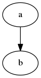

# d3-graphviz

Renders SVG from graphs described in the [DOT](https://www.graphviz.org/doc/info/lang.html) language using the [@hpcc-js/wasm](https://hpcc-systems.github.io/hpcc-js-wasm/) port of [Graphviz](http://www.graphviz.org) and does animated transitions between graphs.

[](https://github.com/magjac/d3-graphviz/actions/workflows/node.js.yml)
[](https://codecov.io/gh/magjac/d3-graphviz)
[](https://www.npmjs.com/package/d3-graphviz)
[](https://unpkg.com/d3-graphviz/build/d3-graphviz.js)
[](https://unpkg.com/d3-graphviz/build/d3-graphviz.min.js)
<a href="https://join.slack.com/t/d3-graphviz/shared_invite/enQtMzMwODQzMDI5MDA5LWU3NTU1ZWNiY2JkYTQyM2ViMTU5ZTRhODJhMDI0MzM3NjEzNDA1NzYxMzRiY2QyMGFmNzkwYzYzYWQ3MmMxYzk"></a>
[](https://gitter.im/d3-graphviz/community?utm_source=badge&utm_medium=badge&utm_campaign=pr-badge)

## Features
* Rendering of SVG graphs from [DOT](https://www.graphviz.org/doc/info/lang.html) source
* Animated transition of one graph into another
* Edge path tweening
* Node shape tweening
* Fade-in and fade-out of entering and exiting nodes and edges
* Animated growth of entering edges
* Panning & zooming of the generated graph

Graphviz methods typically return the Graphviz renderer instance, allowing the concise application of multiple operations on a given graph renderer instance via method chaining.

To render a graph, select an element, call [*selection*.graphviz](#selection_graphviz), and then render from a [DOT](https://www.graphviz.org/doc/info/lang.html) source string. For example:

```js
d3.select("#graph")
  .graphviz()
    .renderDot('digraph {a -> b}');
```

It is also possible to call [d3.graphviz](#d3_graphviz) with a selector as the argument like so:

```js
d3.graphviz("#graph")
    .renderDot('digraph {a -> b}');
```

[](http://bl.ocks.org/magjac/a23d1f1405c2334f288a9cca4c0ef05b)

This basic example can also be seen [here](http://bl.ocks.org/magjac/a23d1f1405c2334f288a9cca4c0ef05b).

A more colorful demo can be seen [here](http://bl.ocks.org/magjac/4acffdb3afbc4f71b448a210b5060bca).

## Installing

The easiest way to use the library in your own application is to install it with NPM:

`npm install d3-graphviz`

If you don't use npm, you can download the [latest release](https://github.com/magjac/d3-graphviz/releases/latest).

## Building the library

You normally don't need to do this, but if you prefer, you can clone from github and build your own copy of the library with:
```text
git clone https://github.com/magjac/d3-graphviz.git
cd d3-graphviz
npm install
npm run build
```
The built library will then be in `build/d3-graphviz.js`

## Principles of Operation

Uses [@hpcc-js/wasm](https://hpcc-systems.github.io/hpcc-js-wasm/) to do a layout of a graph specified in the [DOT](https://www.graphviz.org/doc/info/lang.html) language and generates an SVG text representation, which is analyzed and converted into a data representation. Then [D3](https://d3js.org/) is used to join this data with a selected DOM element, render the SVG graph on that element and to animate transitioning of one graph into another.

## Contents

* [API Reference](#api-reference)
* [Examples](#examples)
* [Building Applications with d3-graphviz](#building-applications-with-d3-graphviz)
* [Data Format](#data-format)
* [Performance](#performance)
* [Requirements](#requirements)
* [Support](#support)
* [Development](#development)
* [Credits](#credits)

## API Reference

* [Defining the @hpcc-js/wasm Script Tag](#defining-the-hpcc-jswasm-script-tag)
* [Creating a Graphviz Renderer](#creating-a-graphviz-renderer)
* [Setting and Getting Options](#setting-and-getting-options)
* [Getting the Graphviz version](#getting-the-graphviz-version)
* [Rendering](#rendering)
* [Images](#images)
* [Creating Transitions](#creating-transitions)
* [Control Flow](#control-flow)
* [Controlling Fade-In & Fade-Out](#controlling-fade-in--fade-out)
* [Controlling Animated Growth of Entering Edges](#controlling-animated-growth-of-entering-edges)
* [Controlling Path Tweening](#controlling-path-tweening)
* [Controlling Shape Tweening](#controlling-shape-tweening)
* [Maintaining Object Constancy](#maintaining-object-constancy)
* [Customizing Graph Attributes](#customizing-graph-attributes)
* [Accessing Elements of the Generated Graph](#accessing-elements-of-the-generated-graph)
* [Accessing the Extracted Data](#accessing-the-extracted-data)
* [Modifying an Existing Graph and Animating the Changes](#modifying-an-existing-graph-and-animating-the-changes)
* [Destroying the Graphviz Renderer](#destroying-the-graphviz-renderer)

### Defining the @hpcc-js/wasm Script Tag

The "@hpcc-js/wasm" script provides functions to do Graphviz layouts. If a web worker is used, these functions are called from the web worker which then loads and compiles the "@hpcc-js/wasm" script explicitly. In this case, it's unnecessary to let the browser also load and compile the script. This is accomplished by using the script tag "javascript/worker" which the browser does not identify to be Javascript and therefore does not compile. However, there are two d3-graphviz functions, [*drawNode*](#graphviz_drawNode) and [*drawEdge*](#graphviz_drawEdge) that calls the layout functions directly and if they are going to be used, the script type must be "application/javascript" or "text/javascript".

Examples:

`<script src="https://unpkg.com/@hpcc-js/wasm/dist/graphviz.umd.js" type="application/javascript/"></script>`

This will always work, but will not be optimal if the script is used in a web worker only.

`<script src="https://unpkg.com/@hpcc-js/wasm/dist/graphviz.umd.js" type="javascript/worker"></script>`

This will work if a web worker is used and the [*drawNode*](#graphviz_drawNode) and [*drawEdge*](#graphviz_drawEdge) functions are not used and will give shorter page load time.

The following table summarizes the recommended script type:

| | *useWorker* = true (default) or<br>*useSharedWorker* = true | *useWorker* = false and<br>*useSharedWorker* = false |
|:--|:--|:--|
| <b>*drawNode()/drawEdge()* is not used</b> | javascript/worker               | application/javascript    |
| <b>*drawNode()/drawEdge()* is used</b>     | application/javascript          | application/javascript    |

### Creating a Graphviz Renderer

#### Creating a Graphviz Renderer on an Existing Selection

<a name="selection_graphviz" href="#selection_graphviz">#</a> <i>selection</i>.<b>graphviz</b>([<i>options</i>]) [<>](https://github.com/magjac/d3-graphviz/blob/master/src/selection/graphviz.js "Source")

Returns a new graphviz renderer instance on the first element in the given *selection*. If a graphviz renderer instance already exists on that element, instead returns the existing graphviz renderer instance. If *options* is specified and is an object, its properties are taken to be options to the graphviz renderer. All options except the *useWorker* and *useSharedWorker* options can also be changed later, using individual methods or the [<i>graphviz</i>.<b>options</b>](#graphviz_options) method, see below.

##### Supported options

| Option | Default value |
|--------|---------------|
| [convertEqualSidedPolygons](#graphviz_convertEqualSidedPolygons) | true |
| [engine](#graphviz_engine) | 'dot' |
| [fade](#graphviz_fade) | true |
| [fit](#graphviz_fit) | false |
| [growEnteringEdges](#graphviz_growEnteringEdges) | true |
| [height](#graphviz_height) | null |
| [keyMode](#graphviz_keyMode) | 'title' |
| [scale](#graphviz_scale) | 1 |
| [tweenPaths](#graphviz_tweenPaths) | true |
| [tweenPrecision](#graphviz_tweenPrecision) | 1 |
| [tweenShapes](#graphviz_tweenShapes) | true |
| [useWorker¹](#the-useworker-and-usesharedworker-options) | true |
| [useSharedWorker¹](#the-useworker-and-usesharedworker-options) | false |
| [width](#graphviz_width) | null |
| [zoom](#graphviz_zoom) | true |
| [zoomScaleExtent](#graphviz_zoomScaleExtent) | [0.1, 10] |
| [zoomTranslateExtent](#graphviz_zoomTranslateExtent) | [[-∞, -∞], [+∞, +∞]] |

¹ Only has effect when the graphviz renderer instance is created.

All options are described below. Only the specified options will be changed. The others will keep their current values. If *options* is a boolean it is taken to be the useWorker option (for backwards compatibility).

##### The useWorker and useSharedWorker options
If the *useSharedWorker* option is truthy, a [shared web worker](https://developer.mozilla.org/en-US/docs/Web/API/SharedWorker) will be used for the layout stage. Otherwise, if *useWorker* is truthy, a [dedicated web worker](https://developer.mozilla.org/en-US/docs/Web/API/Worker) will be used. If both are falsey, no web worker will be used.

#### Creating a Graphviz Renderer Using a Selector String or a Node

<a name="d3_graphviz" href="#d3_graphviz">#</a> <b>d3.graphviz</b>(<i>selector</i>[, <i>options</i>]) [<>](https://github.com/magjac/d3-graphviz/blob/master/src/graphviz.js "Source")

Creates a new graphviz renderer instance on the first element matching the given *selector* string. If the *selector* is not a string, instead creates a new graphviz renderer instance on the specified node. If a graphviz renderer instance already exists on that element, instead returns the existing graphviz renderer instance. See [<i>selection</i>.<b>graphviz</b>](#selection_graphviz) for a description of the *options* argument.

### Setting and Getting Options

<a name="graphviz_options" href="#graphviz_options">#</a> <i>graphviz</i>.<b>options</b>([<i>options</i>]) [<>](https://github.com/magjac/d3-graphviz/blob/master/src/options.js "Source")

If *options* is specified it is taken to be an object whose properties are used to set options to the graphviz renderer. See [<i>selection</i>.<b>graphviz</b>](#selection_graphviz) for a list of supported options. Most options can also be changed by individual methods which are described separately. If *options* is not specified, a copy of the currently set options are returned as an object.

### Getting the Graphviz version

<a name="graphviz_graphvizVersion" href="#graphviz_graphvizVersion">#</a> <i>graphviz</i>.<b>graphvizVersion</b>() [<>](https://github.com/magjac/d3-graphviz/blob/master/src/graphvizVersion.js "Source")

Returns the [Graphviz](https://graphviz.org) version.

### Rendering

<a name="graphviz_renderDot" href="#graphviz_renderDot">#</a> <i>graphviz</i>.<b>renderDot</b>(<i>dotSrc</i>[, <i>callback</i>]) [<>](https://github.com/magjac/d3-graphviz/blob/master/src/renderDot.js "Source")

Starts rendering of an SVG graph from the specified *dotSrc* string and appends it to the selection the Graphviz renderer instance was generated on. [<i>graphviz</i>.<b>renderDot</b>](#graphviz_renderDot) returns "immediately", while the rendering is performed in the background. The layout stage is performed by a web worker (unless the use of a web worker was disabled when the renderer instance was created).

It is also possible to do the [Graphviz](https://www.graphviz.org/doc/info/lang.html) layout in a first separate stage and do the actual rendering of the SVG as a second step like so:

```js
d3.select("#graph")
  .graphviz()
    .dot('digraph {a -> b}')
    .render();
```

This enables doing the computational intensive layout stages for multiple graphs before doing the potentially synchronized rendering of all the graphs simultaneously.

<a name="graphviz_dot" href="#graphviz_dot">#</a> <i>graphviz</i>.<b>dot</b>(<i>dotSrc</i>[, <i>callback</i>]) [<>](https://github.com/magjac/d3-graphviz/blob/master/src/dot.js "Source")

Starts computation of the layout of a graph from the specified *dotSrc* string and saves the data for rendering the SVG with [<i>graphviz</i>.<b>render</b>](#graphviz_render) at a later stage. [<i>graphviz</i>.<b>dot</b>](#graphviz_dot) returns "immediately", while the layout is performed by a web worker in the backrgound. If *callback* is specified and not null, it is called with the `this` context as the graphviz instance, when the layout, data extraction and data processing has been finished.

<a name="graphviz_render" href="#graphviz_render">#</a> <i>graphviz</i>.<b>render</b>([<i>callback</i>]) [<>](https://github.com/magjac/d3-graphviz/blob/master/src/dot.js "Source")

Starts rendering of an SVG graph from data saved by [<i>graphviz</i>.<b>dot</b>](#graphviz_dot) and appends it to the selection the Graphviz renderer instance was generated on. [<i>graphviz</i>.<b>render</b>](#graphviz_render) returns "immediately", while the rendering is performed in the backrgound. If computation of a layout, started with the [<i>graphviz</i>.<b>dot</b>](#graphviz_dot) method has not yet finished, the rendering task is placed in a queue and will commence when the layout is ready. If *callback* is specified and not null, it is called with the `this` context as the graphviz instance, when the graphviz renderer has finished all actions.

<a name="graphviz_engine" href="#graphviz_engine">#</a> <i>graphviz</i>.<b>engine</b>(<i>engine</i>) [<>](https://github.com/magjac/d3-graphviz/blob/master/src/engine.js "Source")

Sets the [Graphviz](http://www.graphviz.org) layout engine name to the specified *engine* string. In order to have effect, the engine must be set before calling [<i>graphviz</i>.<b>dot</b>](#graphviz_dot) or [<i>graphviz</i>.<b>renderDot</b>](#graphviz_renderDot). Supports all engines that [@hpcc-js/wasm](https://hpcc-systems.github.io/hpcc-js-wasm/) supports. Currently these are:

* <b>circo</b>
* <b>dot</b> (default)
* <b>fdp</b>
* <b>sfdp</b>
* <b>neato</b>
* <b>osage</b>
* <b>patchwork</b>
* <b>twopi</b>

<a name="graphviz_onerror" href="#graphviz_onerror">#</a> <i>graphviz</i>.<b>onerror</b>(<i>callback</i>) [<>](https://github.com/magjac/d3-graphviz/blob/master/src/onerror.js "Source")

If *callback* is specified and not null, it is called with the `this` context as the graphviz instance and the error message as the first argument, if the layout computation encounters an error. If *callback* is null, removes any previously registered callback.

### Images
<a name="graphviz_addImage" href="#graphviz_images">#</a> <i>graphviz</i>.<b>addImage</b>(<i>path</i>,<i>width</i>,<i>height</i>) [<>](https://github.com/magjac/d3-graphviz/blob/master/src/images.js "Source")

Add image references as dictated by viz.js, **must be done before renderDot() or dot()**.  
addImage can be called multiple times.

*path* may be a filename ("example.png"), relative or absolute path ("/images/example.png"), or a URL ("http://example.com/image.png")  
Dimensions(*width*,*height*) may be specified with units: in, px, pc, pt, cm, or mm. If no units are given or dimensions are given as numbers, points (pt) are used.  
  
Graphviz does not actually load image data when this option is used — images are referenced with the dimensions given, e.g. in SVG by an \<image> element with width and height attributes.

```js
d3.graphviz("#graph")
    .addImage("images/first.png", "400px", "300px")
    .addImage("images/second.png", "400px", "300px")
    .renderDot('digraph { a[image="images/first.png"]; b[image="images/second.png"]; a -> b }');
```

### Creating Transitions
<a name="graphviz_transition" href="#graphviz_transition">#</a> <i>graphviz</i>.<b>transition</b>([<i>name</i>]) [<>](https://github.com/magjac/d3-graphviz/blob/master/src/transition.js "Source")

Applies the specified transition *name* to subsequent SVG rendering. Accepts the same arguments as [<i>selection</i>.<b>transition</b>](https://github.com/d3/d3-transition#selection_transition) or a function, but returns the graph renderer instance, not the transition. If *name* is a function, it is taken to be a transition factory. A transition factory is a function that returns a transition; when the rendering starts, the factory is evaluated once, with the `this` context as the graphviz instance. To attach a preconfigured transition, first create a transition instance with [d3.transition](https://github.com/d3/d3-transition#transition), configure it and attach it with [<i>graphviz</i>.<b>transition</b>](#graphviz_transition) like so:

```js
var t = d3.transition()
    .duration(750)
    .ease(d3.easeLinear);

d3.select("#graph").graphviz()
    .transition(t)
    .renderDot('digraph {a -> b}');
```

A transition is scheduled when it is created. The above example will schedule the transition *before* the layout is computed, i.e. synchronously. But if, instead, a transition factory is used, the transition will be scheduled *after* the layout is computed, i.e. asynchronously.

<b>NOTE:</b> Transitions should be named if zooming is enabled. Transitions using the null name [will be interrupted](https://github.com/d3/d3-zoom/issues/110) by the [zoom behavior](https://github.com/d3/d3-zoom), causing the graph to be rendered incorrectly.

<a name="graphviz_active" href="#graphviz_active">#</a> <i>graphviz</i>.<b>active</b>([<i>name</i>]) [<>](https://github.com/magjac/d3-graphviz/blob/master/src/transition.js "Source")

Returns the active transition on the generated graph's top level <b>svg</b> with the specified *name*, if any. If no *name* is specified, null is used. Returns null if there is no such active transition on the top level <b>svg</b> node. This method is useful for creating chained transitions.

### Controlling SVG Size and Graph Size

The SVG size determines the area in which the graph can be panned and zoomed, while the graph size determines the area that the graph occupies before it is panned or zoomed. The default is that these two areas are the same.

The size of the graph is determined in three optional steps:

1. The SVG size can be set with [<i>graphviz</i>.<b>width</b>](#graphviz_width) and/or [<i>graphviz</i>.<b>height</b>](#graphviz_height).
2. The graph can be scaled to fit the SVG size with [<i>graphviz</i>.<b>fit</b>](#graphviz_fit) or maintain its original size.
3. The graph can be additionally scaled with a scaling factor with [<i>graphviz</i>.<b>scale</b>](#graphviz_scale).

<a name="graphviz_width" href="#graphviz_width">#</a> <i>graphviz</i>.<b>width</b>(<i>width</i>) [<>](https://github.com/magjac/d3-graphviz/blob/master/src/width.js "Source")

The SVG width attribute is set to *width* pixels.

<a name="graphviz_height" href="#graphviz_height">#</a> <i>graphviz</i>.<b>height</b>(<i>height</i>) [<>](https://github.com/magjac/d3-graphviz/blob/master/src/height.js "Source")

The SVG height attribute is set to *height* pixels.

<a name="graphviz_fit" href="#graphviz_fit">#</a> <i>graphviz</i>.<b>fit</b>(<i>fit</i>) [<>](https://github.com/magjac/d3-graphviz/blob/master/src/height.js "Source")

If *fit* is falsey (default), the viewBox attribute of the SVG is set so that the graph size (before scaling with [<i>graphviz</i>.<b>scale</b>](#graphviz_scale)) is its orignal size, i.e. unaffected by a possible SVG size change with [<i>graphviz</i>.<b>width</b>](#graphviz_width) or [<i>graphviz</i>.<b>height</b>](#graphviz_height). If *fit* is truthy, the viewBox attribute of the SVG is unchanged, which causes the graph size (before scaling with [<i>graphviz</i>.<b>scale</b>](#graphviz_scale)) to fit the SVG size. Note that unless the SVG size has been changed, this options has no effect.

<a name="graphviz_scale" href="#graphviz_scale">#</a> <i>graphviz</i>.<b>scale</b>(<i>scale</i>) [<>](https://github.com/magjac/d3-graphviz/blob/master/src/height.js "Source")

The viewBox attribute of the SVG is set so that the graph size (after a possible fit to the SVG size with [<i>graphviz</i>.<b>fit</b>](#graphviz_fit)) is scaled with *scale*. For example: If *scale* is 0.5, then if *fit* is truthy, the graph width and height is half the width and height of the SVG, while if *fit* is falsey, the graph width and height is half of its original width and height.

### Control Flow

For advanced usage, the Graphviz renderer provides methods for custom control flow.

<a name="graphviz_on" href="#graphviz_on">#</a> <i>graphviz</i>.<b>on</b>(<i>typenames</i>[, <i>listener</i>]) [<>](https://github.com/magjac/d3-graphviz/blob/master/src/on.js "Source")

Adds or removes a *listener* to the Graphviz renderer instance for the specified event *typenames*. The *typenames* is one of the following string event types:

* `initEnd` - when the Graphviz renderer has finished initialization.
* `start` - when analysis of the DOT source starts.
* `layoutStart` - when the layout of the DOT source starts.
* `layoutEnd` - when the layout of the DOT source ends.
* `dataExtractEnd` - when the extraction of data from the SVG text representation ends.
* `dataProcessPass1End` - when the first pass of the processing of the extracted data ends.
* `dataProcessPass2End` - when the second pass of the processing of the extracted data ends.
* `dataProcessEnd` - when the processing of the extracted data ends.
* `renderStart` - when the rendering preparation starts, which is just before an eventual transition factory is called.
* `renderEnd` - when the rendering preparation ends.
* `transitionStart` - when the animated transition starts.
* `transitionEnd` - when the animated transition ends.
* `restoreEnd` - when possibly converted paths and shapes have been restored after the transition.
* `end` - when the Graphviz renderer has finished all actions.
* `zoom` - when the layout has been zoomed.

Note that these are *not* native DOM events as implemented by [*selection*.on](https://github.com/d3/d3-selection#selection_on) and [*selection*.dispatch](https://github.com/d3/d3-selection#selection_dispatch), but Graphviz events!

The type may be optionally followed by a period (`.`) and a name; the optional name allows multiple callbacks to be registered to receive events of the same type, such as `start.foo` and `start.bar`. To specify multiple typenames, separate typenames with spaces, such as `interrupt end` or `start.foo start.bar`.

When a specified Graphviz event is dispatched, the specified *listener* will be invoked with the `this` context as the graphviz instance.

If an event listener was previously registered for the same *typename* on a selected element, the old listener is removed before the new listener is added. To remove a listener, pass null as the *listener*. To remove all listeners for a given name, pass null as the *listener* and `.foo` as the *typename*, where `foo` is the name; to remove all listeners with no name, specify `.` as the *typename*.

<a name="graphviz_logEvents" href="#graphviz_logEvents">#</a> <i>graphviz</i>.<b>logEvents</b>(<i>enable</i>) [<>](https://github.com/magjac/d3-graphviz/blob/master/src/logEvents.js "Source")

If *enable* is true (default), adds event listeners, using the name "log", for all available events. When invoked, each listener will print a one-line summary containing the event number and type, the time since the previous event and the time since the "start" event to the console log. For some events, additionally calculated times are printed. This method can be used for debugging or for tuning transition delay and duration. If *enable* is false, removes all event listeners named "log".

### Controlling Fade-In & Fade-Out

<a name="graphviz_fade" href="#graphviz_fade">#</a> <i>graphviz</i>.<b>fade</b>(<i>enable</i>) [<>](https://github.com/magjac/d3-graphviz/blob/master/src/fade.js "Source")

If *enable* is true (default), enables fade-in and fade-out of nodes and shapes, else disables fade-in and fade-out.

### Controlling Animated Growth of Entering Edges

<a name="graphviz_growEnteringEdges" href="#graphviz_growEnteringEdges">#</a> <i>graphviz</i>.<b>growEnteringEdges</b>(<i>enable</i>) [<>](https://github.com/magjac/d3-graphviz/blob/master/src/growEnteringEdges.js "Source")

If *enable* is true (default), enables animated growth of entering edges, else disables animated growth of entering edges.

**Note:** Growing edges with style `tapered` is not supported.

A demo of animated growth of entering edges can be seen [here](http://bl.ocks.org/magjac/f485e7b915c9699aa181a11e183f8237)

### Controlling Path Tweening

<a name="graphviz_tweenPaths" href="#graphviz_tweenPaths">#</a> <i>graphviz</i>.<b>tweenPaths</b>(<i>enable</i>) [<>](https://github.com/magjac/d3-graphviz/blob/master/src/tweenPaths.js "Source")

If *enable* is true (default), enables path tweening, else disables path tweening.

<a name="graphviz_tweenPrecision" href="#graphviz_tweenPrecision">#</a> <i>graphviz</i>.<b>tweenPrecision</b>(<i>precision</i>) [<>](https://github.com/magjac/d3-graphviz/blob/master/src/tweenPrecision.js "Source")

If *precision* is a number, sets the precision used during path tweening to *precision* points. The precision is the length of each path segment during tweening. If instead *precision* is a string containing '%', sets the relative precision. When using a relative precision, the absolute precision is calculated as the length of the object being tweened multiplied with the relative precision, i.e. the number of line segments during tweening will be the inverse of the relative precision. For example, a relative precision of 5% will give 20 line segments. For a path which is 200 points long, this will give a precision of 10 points. Default is an absolute precision of 1 point.

### Controlling Shape Tweening

<a name="graphviz_tweenShapes" href="#graphviz_tweenShapes">#</a> <i>graphviz</i>.<b>tweenShapes</b>(<i>enable</i>) [<>](https://github.com/magjac/d3-graphviz/blob/master/src/tweenShapes.js "Source")

If *enable* is true (default), enables shape tweening during transitions, else disables shape tweening. If *enable* is true, also enables path tweening since shape tweening currently is performed by converting SVG ellipses and polygons to SVG paths and do path tweening on them. At the end of the transition the original SVG shape element is restored.

<a name="graphviz_convertEqualSidedPolygons" href="#graphviz_convertEqualSidedPolygons">#</a> <i>graphviz</i>.<b>convertEqualSidedPolygons</b>(<i>enable</i>) [<>](https://github.com/magjac/d3-graphviz/blob/master/src/convertEqualSidedPolygons.js "Source")

If *enable* is true (default), enables conversion of polygons with equal number of sides during shape tweening, else disables conversion. Not applicable when shape tweening is disabled. At the end of the transition the original SVG shape element is restored.

A demo of shape tweening can be seen [here](http://bl.ocks.org/magjac/69dc955a2e2ee085f60369c4a73f92a6).

### Controlling Panning & Zooming

<a name="graphviz_zoom" href="#graphviz_zoom">#</a> <i>graphviz</i>.<b>zoom</b>(<i>enable</i>) [<>](https://github.com/magjac/d3-graphviz/blob/master/src/zoom.js "Source")

If *enable* is true (default), enables panning and zooming, else disables panning and zooming. The zoom behavior is applied to the graph's top level <b>svg</b> element.

<a name="graphviz_zoomBehavior" href="#graphviz_zoomBehavior">#</a> <i>graphviz</i>.<b>zoomBehavior</b>() [<>](https://github.com/magjac/d3-graphviz/blob/master/src/zoom.js "Source")

Returns the [zoom behavior](https://github.com/d3/d3-zoom#zoom) if zooming is enabled and a graph has been rendered, else returns null.

<a name="graphviz_zoomSelection" href="#graphviz_zoomSelection">#</a> <i>graphviz</i>.<b>zoomSelection</b>() [<>](https://github.com/magjac/d3-graphviz/blob/master/src/zoom.js "Source")

Returns the [selection](https://github.com/d3/d3-selection#selection) to which the [zoom behavior](https://github.com/d3/d3-zoom#zoom) has been applied if zooming is enabled and a graph has been rendered, else returns null.

<a name="graphviz_zoomScaleExtent" href="#graphviz_zoomScaleExtent">#</a> <i>graphviz</i>.<b>zoomScaleExtent</b>([<i>extent</i>]) [<>](https://github.com/magjac/d3-graphviz/blob/master/src/zoom.js "Source")

Sets the scale extent to the specified array of numbers [k0, k1] where k0 is the minimum allowed scale factor and k1 is the maximum allowed scale factor. The scale extent restricts zooming in and out. For details see [*zoom*.scaleExtent](https://github.com/d3/d3-zoom#zoom_scaleExtent).

<a name="graphviz_zoomTranslateExtent" href="#graphviz_zoomTranslateExtent">#</a> <i>graphviz</i>.<b>zoomTranslateExtent</b>([<i>extent</i>]) [<>](https://github.com/magjac/d3-graphviz/blob/master/src/zoom.js "Source")

Sets the translate extent to the specified array of points [[x0, y0], [x1, y1]], where [x0, y0] is the top-left corner of the world and [x1, y1] is the bottom-right corner of the world. The translate extent restricts panning, and may cause translation on zoom out. For details see [*zoom*.translateExtent](https://github.com/d3/d3-zoom#zoom_translateExtent).

<a name="graphviz_resetZoom" href="#graphviz_resetZoom">#</a> <i>graphviz</i>.<b>resetZoom</b>([<i>transition</i>]) [<>](https://github.com/magjac/d3-graphviz/blob/master/src/zoom.js "Source")

Restores the original graph by resetting the transformation made by panning and zooming. If *transition* is specified and not null, it is taken to be a transition instance which is applied during zoom reset.

### Maintaining [Object Constancy](https://bost.ocks.org/mike/constancy/)

In order to achieve [meaningful transitions](https://bost.ocks.org/mike/constancy/#when-constancy-matter), the D3 default join-by-index [key function](https://bost.ocks.org/mike/constancy/#key-functions) is not sufficient. Four different key modes are available that may be useful in different situations:

* <b>title</b> (default) - Uses the text of the SVG title element for each node and edge <b>g</b> element as generated by [Graphviz](http://www.graphviz.org). For nodes, this is "[<i>node_id</i>](https://www.graphviz.org/doc/info/lang.html)" (not to be confused with the node attribute [<i>id</i>](http://www.graphviz.org/content/attrs#did)) and for edges it is "[<i>node_id</i>](https://www.graphviz.org/doc/info/lang.html) [<i>edgeop</i>](https://www.graphviz.org/doc/info/lang.html) [<i>node_id</i>](https://www.graphviz.org/doc/info/lang.html)", e.g. "a -> b". For node and edge sub-elements, the <b>tag-index</b> key mode is used, see below.
* <b>id</b> - Uses the <b>id</b> attribute of the node and edge SVG <b>g</b> elements as generated by [Graphviz](http://www.graphviz.org). Note that unless the graph author specifies [<i>id</i>](http://www.graphviz.org/content/attrs#did) attributes for nodes and edges, [Graphviz](http://www.graphviz.org) generates a unique internal id that is unpredictable by the graph writer, making the <b>id</b> key mode not very useful. For node and edge sub-elements, the <b>tag-index</b> key mode is used, see below.
* <b>tag-index</b> - Uses a key composed of the [SVG element](https://www.w3.org/TR/SVG/eltindex.html) tag, followed by a dash (-) and the relative index of that element within all sibling elements with the same tag. For example: ellipse-0. Normally not very useful for other than static graphs, since all nodes and edges are siblings and are generated as SVG <b>g</b> elements.
* <b>index</b> - Uses the D3 default join-by-index key function. Not useful for other than static graphs.

<a name="graphviz_keyMode" href="#graphviz_keyMode">#</a> <i>graphviz</i>.<b>keyMode</b>(<i>mode</i>) [<>](https://github.com/magjac/d3-graphviz/blob/master/src/keyMode.js "Source")

Sets the key mode to the specified *mode* string. If *mode* is not one of the defined key modes above, an error is thrown. The key mode must be set before attaching the [DOT](https://www.graphviz.org/doc/info/lang.html) source. If it is changed after this, an error is thrown.

### Customizing Graph Attributes

<a name="graphviz_attributer" href="#graphviz_attributer">#</a> <i>graphviz</i>.<b>attributer</b>(<i>function</i>) [<>](https://github.com/magjac/d3-graphviz/blob/master/src/attributer.js "Source")

If the *function* is a function, it is evaluated for each SVG element, before applying attributes and transitions, being passed the current datum (*d*), the current index (*i*), and the current group (*nodes*), with *this* as the current DOM element (*nodes*[*i*]). If *function* is null, removes the attributer. For example, to set the fill color of ellipses to yellow and fade to red during transition:


```js
var t = d3.transition()
    .duration(2000)
    .ease(d3.easeLinear);

d3.select("#graph").graphviz()
    .transition(t)
    .attributer(function(d) {
        if (d.tag == "ellipse") {
            d3.select(this)
                .attr("fill", "yellow");
            d.attributes.fill = "red";
        }
    })
    .renderDot('digraph {a -> b}');
```

### Accessing Elements of the Generated Graph

<a name="selection_selectWithoutDataPropagation" href="#selection_selectWithoutDataPropagation">#</a> <i>selection</i>.<b>selectWithoutDataPropagation</b>() [<>](https://github.com/magjac/d3-graphviz/blob/master/src/selection/selectWithoutDataPropagation.js "Source")

For each selected element, selects the first descendant element that matches the specified selector string in the same ways as  [*selection*.select](https://github.com/d3/d3-selection#selection_select), but does *not* propagate any associated data from the current element to the corresponding selected element.

## Accessing the Extracted Data

<a name="graphviz_data" href="#graphviz_data">#</a> <i>graphviz</i>.<b>data</b>() [<>](https://github.com/magjac/d3-graphviz/blob/master/src/data.js "Source")

Returns the data extracted by [<i>graphviz</i>.<b>dot</b>](#graphviz_dot) or null if no such data exists.

### Modifying an Existing Graph and Animating the Changes

This API provides methods draw nodes and edges and inserting them into the graph data. The application can then animate the changes made by providing and updated DOT source and render a new layout. The API also supports removing nodes and edge from the graph and the graph data.

<a name="graphviz_drawEdge" href="#graphviz_drawEdge">#</a> <i>graphviz</i>.<b>drawEdge</b>(<i>x1</i>, <i>y1</i>, <i> x2</i>, <i> y2</i>[, <i> attributes</i>][, <i> options</i>]) [<>](https://github.com/magjac/d3-graphviz/blob/master/src/drawEdge.js "Source")

Draws a straight edge from (*x1*, *y1*) to (*x2*, *y2*) using coordinates relative to top level [G container element](https://www.w3.org/TR/SVG/struct.html#Groups) of the graph. Typically these coordinates are obtained with [d3.mouse](https://github.com/d3/d3-selection#mouse). If *attributes* is specified, it is taken to be an object containing [DOT attributes](https://www.graphviz.org/doc/info/attrs.html) as properties to be used when drawing the node. If not specified, the default values of those attributes are used. If *options* is specified, it is taken to be an object containing properties which are used as options when drawing the edge. The currently supported options are:

* <b>shortening</b> - The number of points by which to draw the edge shorter than given by the coordinates. This is useful to avoid that the currently drawn edge is prohibiting mouse events on elements beneath the current mouse position. A typical such value is 2. The default value is 0.

<a name="graphviz_updateDrawnEdge" href="#graphviz_updateDrawnEdge">#</a> <i>graphviz</i>.<b>updateDrawnEdge</b>(<i>x1</i>, <i>y1</i>, <i> x2</i>, <i> y2</i>[, <i> attributes</i>][, <i> options</i>]) [<>](https://github.com/magjac/d3-graphviz/blob/master/src/drawEdge.js "Source")

Updates properties and attributes of the edge currently drawn with [<i>graphviz</i>.<b>drawEdge</b>](#graphviz_drawEdge), using the same arguments. This method cannot be used after the edge has been inserted into the graph data with [<i>graphviz</i>.<b>insertDrawnEdge</b>](#graphviz_insertDrawnEdge).

<a name="graphviz_moveDrawnEdgeEndPoint" href="#graphviz_moveDrawnEdgeEndPoint">#</a> <i>graphviz</i>.<b>moveDrawnEdgeEndPoint</b>(<i> x2</i>, <i> y2</i>[, <i> options</i>]) [<>](https://github.com/magjac/d3-graphviz/blob/master/src/drawEdge.js "Source")

Updates the end point of the edge currently drawn with [<i>graphviz</i>.<b>drawEdge</b>](#graphviz_drawEdge), accepting the same *options* argument. This method cannot be used after the edge has been inserted into the graph data with [<i>graphviz</i>.<b>insertDrawnEdge</b>](#graphviz_insertDrawnEdge).

<a name="graphviz_insertDrawnEdge" href="#graphviz_insertDrawnEdge">#</a> <i>graphviz</i>.<b>insertDrawnEdge</b>(<i>name</i>) [<>](https://github.com/magjac/d3-graphviz/blob/master/src/drawEdge.js "Source")

Inserts the edge into the graph data, making it available for an animated transition into a subsequent new layout perfomed with [<i>graphviz</i>.<b>render</b>](#graphviz_render) or [<i>graphviz</i>.<b>renderDot</b>](#graphviz_renderDot). *name* is typically [<i>node_id</i>](https://www.graphviz.org/doc/info/lang.html) [<i>edgeop</i>](https://www.graphviz.org/doc/info/lang.html) [<i>node_id</i>](https://www.graphviz.org/doc/info/lang.html) according to the [DOT language](https://www.graphviz.org/doc/info/lang.html), e.g. "a -> b".

<a name="graphviz_removeDrawnEdge" href="#graphviz_removeDrawnEdge">#</a> <i>graphviz</i>.<b>removeDrawnEdge</b>() [<>](https://github.com/magjac/d3-graphviz/blob/master/src/drawEdge.js "Source")

Removes the edge currently drawn with [<i>graphviz</i>.<b>drawEdge</b>](#graphviz_drawEdge). This method cannot be used after the edge has been inserted into the graph data with [<i>graphviz</i>.<b>insertDrawnEdge</b>](#graphviz_insertDrawnEdge).

<a name="graphviz_drawNode" href="#graphviz_drawNode">#</a> <i>graphviz</i>.<b>drawNode</b>(<i>x</i>, <i>y</i>, <i>nodeId</i>[, <i> attributes</i>]) [<>](https://github.com/magjac/d3-graphviz/blob/master/src/drawNode.js "Source")

Draws a node with the upper left corner of its bounding box at (*x*, *y*), using coordinates relative to the top level [G container element](https://www.w3.org/TR/SVG/struct.html#Groups) of the graph. Typically these coordinates are obtained with [d3.mouse](https://github.com/d3/d3-selection#mouse). *nodeId* is the [<i>node_id</i>](https://www.graphviz.org/doc/info/lang.html) according to the [DOT language](https://www.graphviz.org/doc/info/lang.html). If *attributes* is specified, it is taken to be an object containing [DOT attributes](https://www.graphviz.org/doc/info/attrs.html) as properties to be used when drawing the node. If not specified, the default values of those attributes are used.

<b>NOTE:</b> User-defined shapes are not supported.

<a name="graphviz_updateDrawnNode" href="#graphviz_updateDrawnNode">#</a> <i>graphviz</i>.<b>updateDrawnNode</b>(<i>x</i>, <i>y</i>, <i>nodeId</i>[, <i> attributes</i>]) [<>](https://github.com/magjac/d3-graphviz/blob/master/src/drawNode.js "Source")

Updates properties and attributes of the node currently drawn with [<i>graphviz</i>.<b>drawNode</b>](#graphviz_drawNode), using the same arguments. This method cannot be used after the node has been inserted into the graph data with [<i>graphviz</i>.<b>insertDrawnNode</b>](#graphviz_insertDrawnNode).

<a name="graphviz_moveDrawnNode" href="#graphviz_moveDrawnNode">#</a> <i>graphviz</i>.<b>moveDrawnNode</b>(<i> x</i>, <i> y</i>[, <i> options</i>]) [<>](https://github.com/magjac/d3-graphviz/blob/master/src/drawNode.js "Source")

Updates the position of the upper left corner of the node currently drawn with [<i>graphviz</i>.<b>drawNode</b>](#graphviz_drawNode), accepting the same *options* argument. This method cannot be used after the node has been inserted into the graph data with [<i>graphviz</i>.<b>insertDrawnNode</b>](#graphviz_insertDrawnNode).

<a name="graphviz_insertDrawnNode" href="#graphviz_insertDrawnNode">#</a> <i>graphviz</i>.<b>insertDrawnNode</b>(<i>nodeId</i>) [<>](https://github.com/magjac/d3-graphviz/blob/master/src/drawNode.js "Source")

Inserts the node into the graph data, making it available for an animated transition into a subsequent new layout performed with [<i>graphviz</i>.<b>render</b>](#graphviz_render) or [<i>graphviz</i>.<b>renderDot</b>](#graphviz_renderDot). *nodeId* is the [<i>node_id</i>](https://www.graphviz.org/doc/info/lang.html) according to the [DOT language](https://www.graphviz.org/doc/info/lang.html).

<a name="graphviz_removeDrawnNode" href="#graphviz_removeDrawnNode">#</a> <i>graphviz</i>.<b>removeDrawnNode</b>() [<>](https://github.com/magjac/d3-graphviz/blob/master/src/drawNode.js "Source")

Removes the node currently drawn with [<i>graphviz</i>.<b>drawNode</b>](#graphviz_drawNode). This method cannot be used after the node has been inserted into the graph data with [<i>graphviz</i>.<b>insertDrawnNode</b>](#graphviz_insertDrawnNode).

<a name="graphviz_drawnNodeSelection" href="#graphviz_drawnNodeSelection">#</a> <i>graphviz</i>.<b>drawnNodeSelection</b>() [<>](https://github.com/magjac/d3-graphviz/blob/master/src/drawNode.js "Source")

Returns a [selection](https://github.com/d3/d3-selection#selection) containing the node currently being drawn. The selection is empty if no node has been drawn or the last drawn node has been inserted into the graph data with [<i>graphviz</i>.<b>insertDrawnNode</b>](#graphviz_insertDrawnNode).

### Destroying the Graphviz Renderer

<a name="graphviz_destroy" href="#graphviz_destroy">#</a> <i>graphviz</i>.<b>destroy</b>() [<>](https://github.com/magjac/d3-graphviz/blob/master/src/destroy.js "Source")

Removes the Graphviz renderer from the element it was created on, terminates any active dedicated web worker and closes any port connected to a shared web worker.

## Examples

There are plenty of examples in the [examples](https://github.com/magjac/d3-graphviz/tree/master/examples) folder. To see them in action you must build the library and start a web server. You cannot just open them through `file:` in your browser. Here is one way to do it:

```text
git clone https://github.com/magjac/d3-graphviz.git
cd d3-graphviz
npm install
npm run build
npm install http-server
node_modules/.bin/http-server .
```

There are also a few examples directly available online:

* [Basic Example](http://bl.ocks.org/magjac/a23d1f1405c2334f288a9cca4c0ef05b)
* [Demo](http://bl.ocks.org/magjac/4acffdb3afbc4f71b448a210b5060bca)
* [Shape Tweening Demo](http://bl.ocks.org/magjac/69dc955a2e2ee085f60369c4a73f92a6)
* [Delete Nodes and Edge Demo Application](https://bl.ocks.org/magjac/28a70231e2c9dddb84b3b20f450a215f)
* [Animated Growth of Entering Edges Demo](http://bl.ocks.org/magjac/f485e7b915c9699aa181a11e183f8237)

## Building Applications with [d3-graphviz](https://github.com/magjac/d3-graphviz)
### SVG structure
The generated SVG graph has *exactly* the same structure as the SVG generated by [@hpcc-js/wasm](https://github.com/hpcc-systems/hpcc-js-wasm), so applications utilizing knowledge about this structure should be able to use [d3-graphviz](https://github.com/magjac/d3-graphviz) without adaptations. If [path tweening](#controlling-path-tweening) or [shape tweening](#controlling-path-tweening) is used, some SVG elements may be converted during transitions, but they are restored to the original shape after the transition.

See this [example application](https://bl.ocks.org/magjac/28a70231e2c9dddb84b3b20f450a215f).

### <b>NOTE:</b> avoid [*selection*.select](https://github.com/d3/d3-selection#selection_select)
When selecting elements within the graph, [*selection*.select](https://github.com/d3/d3-selection#selection_select) *must not be used* if additional rendering is going to be performed on the same graph renderer instance. This is due to the fact that [*selection*.select](https://github.com/d3/d3-selection#selection_select) propagates data from the elements in the selection to the corresponding selected elements, causing already bound data to be overwritten with incorrect data and subsequent errors. Use the [<i>selection</i>.<b>selectWithoutDataPropagation</b>()](#selection_selectWithoutDataPropagation) (a [d3-graphviz](https://github.com/magjac/d3-graphviz) extension of [d3-selection](https://github.com/d3/d3-selection)) or [*selection*.selectAll](https://github.com/d3/d3-selection#selection_selectAll), which do not propagate data or [*selection*.node](https://github.com/d3/d3-selection#selection_node) and [querySelector](https://www.w3.org/TR/selectors-api/#queryselector). For example, to select the first <b>g</b> element within the first <b>svg</b> element within a specified <b>div</b> element:


```js
var div = d3.select("#graph");
var svg = d3.select(div.node().querySelector("svg"));
var g = d3.select(svg.node().querySelector("g"));
 ```

For more, read [this issue](https://github.com/d3/d3/issues/1443) and [this Stack Overflow post](https://stackoverflow.com/questions/17846806/preventing-unwanted-data-inheritance-with-selection-select).

## Data Format

The data bound to each DOM node is an object containing the following fields:
 * <b>tag</b> - The DOM node tag.
 * <b>attributes</b> - An object containing attributes as properties.
 * <b>children</b> - An array of data for the node's children.
 * <b>key</b> - The key used when binding data to nodes with the [key function](https://github.com/d3/d3-selection#joining-data). See [<i>graphviz</i>.<b>keyMode</b>](#graphviz_keyMode) for more.
 * <b>text</b> - Contains the text if the DOM node is a [Text node](https://www.w3.org/TR/DOM-Level-3-Core/core.html#ID-1312295772). A text node has the tag "<b>#text</b>", not to be confused with the tag "<b>text</b>", which is an [SVG <b>'text</b>' element](https://www.w3.org/TR/SVG/text.html#TextElement).
 * <b>comment</b> - Contains the comment if the DOM node is a [Comment node](https://www.w3.org/TR/DOM-Level-3-Core/core.html#ID-1728279322). A comment node has the tag "<b>#comment</b>".

Other fields are used internally, but may be subject to change between releases and should not be used by an external application.

To inspect data:

```js
d3.select("#graph").graphviz()
    .renderDot('digraph  {a -> b}');
console.log(JSON.stringify(d3.select("svg").datum(), null, 4));
 ```

## Performance

The shape- and path-tweening operations are quite computational intensive and can be disabled with [<i>graphviz</i>.<b>tweenShapes</b>](#graphviz_tweenShapes) and [<i>graphviz</i>.<b>tweenPaths</b>](#graphviz_tweenPaths) to improve performance if they are not needed. Even if enabled, performance gains can be made by turning off conversion of equally sided polygons with [<i>graphviz</i>.<b>convertEqualSidedPolygons</b>](#graphviz_convertEqualSidedPolygons) or by reducing tween precision by setting a larger value with [<i>graphviz</i>.<b>tweenPrecision</b>](#graphviz_tweenPrecision).

In order for animated transitions to be smooth, special considerations has been made to do the computational intensive operations before transitions start.

## Requirements

[d3-graphviz](https://github.com/magjac/d3-graphviz) transpiles the production build to [ES5](https://www.ecma-international.org/ecma-262/5.1/) before publishing it on [npm](https://www.npmjs.com/), so it should be possible to use it with most build tools and browsers.

## Support

When asking for help, please include a link to a live example that demonstrates the issue, preferably on [JSFiddle](https://jsfiddle.net/). It is often impossible to debug from code snippets alone. Isolate the issue and reduce your code as much as possible before asking for help. The less code you post, the easier it is for someone to debug, and the more likely you are to get a helpful response.

### Be notified of updates

By clicking the **Watch** button, you will stay tuned for updates to the library.

### Getting help

* For specific questions, please use [Stack Overflow tags d3.js & graphviz](https://stackoverflow.com/tags/d3.js+graphviz).

* For general discussions regarding d3-graphviz, please use the [Graphviz forum](https://forum.graphviz.org/c/d3-graphviz/9).

### Reporting bugs

If you think you have found a bug in d3-graphviz itself, please [file an issue](https://github.com/magjac/d3-graphviz/issues/new).

## Development

In order to run the tests you need [Node.js](https://nodejs.org/en/download/package-manager/) 14.x or later. Version 18.8.0 was used during development.

## Credits

* [Gordon Smith](https://github.com/GordonSmith) for [@hpcc-js/wasm](https://github.com/hpcc-systems/hpcc-js-wasm).
* [Mike Bostock](https://github.com/mbostock) for the [Path Tween](https://bl.ocks.org/mbostock/3916621) code and [Stroke Dash Interpolation](https://bl.ocks.org/mbostock/5649592) code.
* [Aaron Bycoffe](https://bl.ocks.org/bycoffe) for the [Element rotation with point-along-path interpolation](http://bl.ocks.org/bycoffe/c3849a0b15234d7e32fc) code.
* [Marcin Stefaniuk](https://github.com/mstefaniuk) for inspiration and learning through [graph-viz-d3-js](https://github.com/mstefaniuk/graph-viz-d3-js).
* [Ueyama Satoshi](https://github.com/gyuque) for inspiring growing edges through [livizjs](http://ushiroad.com/jsviz/).
